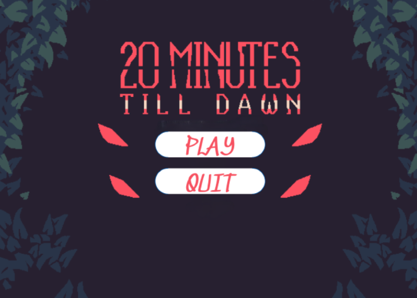
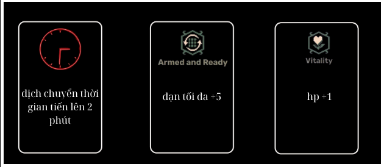

**20 MINUTES TILL DAWN**

**GIỚI THIỆU GAME**

20 minutes till dawn là một tựa game sinh tồn. Bạn sẽ phải sinh tồn giữa một mê cung đầy quái vật trong thời gian 20 phút. Vượt qua được 20 phút đó, bình minh sẽ lên và bạn đã sinh tồn thành công.

**1. Bắt đầu game**

Sau khi vào game, màn hình bắt đầu sẽ hiện ra.

Click "play" nếu bạn muốn bắt đầu chơi hoặc "quit" nếu bạn muốn thoát.

**2. Các thành phần trong game**

Giao diện khi vào game

Hình ảnh nhân vật của bạn:

Hình ảnh quái vật bạn cần tránh:

Thanh kinh nghiệm (đầy thanh sẽ được lên level):

Chỉ số sinh mệnh và đạn:

Đồng hồ (chạy đến 20:00 thì bạn sẽ thắng):

**3. Cách chơi**

Sử dụng các nút mũi tên hoặc các nút "w,a,s,d" để di chuyển. Sử dụng chuột để bắn, bấm chuột trái để bắn, đạn sẽ bắn theo hướng của chuột. Khởi đầu, bạn có 11 viên đạn và 5 mạng. Sau khi sử dụng hết đạn sẽ mất 3 giây để nạp lại đạn. 

Cố gắng di chuyển và sử dụng đạn hợp lí để tránh quái vật. Nếu bạn bị quái vật chạm vào sẽ mất 1 hp. Nếu bạn tiêu diệt được 40 quái vật sẽ được lên level và có 3 lựa chọn nâng cấp(Sử dụng các nút "1,2,3" để lựa chọn nâng cấp tương ứng.):

Nút 1 (Đồng hồ sẽ nhảy đến 2 phút sau)

Nút 2 (tăng số lượng đạn tối đa lên 5 viên)

Nút 3 (tăng chỉ số sinh mệnh lên 1)

**4. Chiến thắng và thất bại**

Bạn sẽ chiến thắng nếu sinh tồn được đến khi đồng hồ chỉ 20:00 

Bạn sẽ thua nếu bạn chết trước khi đồng hồ chỉ 20:00 

Click "play" nếu bạn muốn chơi tiếp hoặc "quit" nếu bạn muốn thoát.

**VỀ ĐỒ HỌA GAME**

Sử dụng ứng dụng LibreSprite để làm sprite sheet (Link download: https://libresprite.github.io/#!/downloads). Có tham khảo tại các nguồn: https://flanne.itch.io/10-minutes-till-dawn; https://minutes-till-dawn.fandom.com/wiki/Minutes_Till_Dawn_Wiki.

Về các file âm thanh, file music lấy từ các nguồn: 
https://www.youtube.com/watch?v=BjiMgkhV41M;
https://www.youtube.com/watch?v=MmO-1pG5Owo. 
Các file chunk lấy từ nguồn: https://pixabay.com/sound-effects/.

Các file ảnh khác lấy từ google hình ảnh.

**VỀ SOURCE CODE GAME**

- file commonFunc: chứa các hàm cơ bản được dùng xuyên suốt chương trình.
  - init: khởi tạo window và renderer (tham khảo trên lazyFoo)
  - close: giải phóng bộ nhớ (tham khảo trên lazyFoo)
  - checkCollision: kiểm tra va chạm (tham khảo trên phattrienphanmem123az)
  - checkCollision2: xử lí va chạm của nhân vật
  - timX, timY: tìm tọa độ của điểm thẳng hàng với 2 điểm cho trước
- file const.h: include thư viện và khai báo các hằng số
- file texture: quản lý các texture, khởi tạo, tải lên và giải phóng.(tham khảo trên lazyFoo)
- file imgTimer: xử lý thời gian, dùng để tính thời gian cho đồng hồ.(tham khảo trên phattrienphanmem123az)
- file enemies: quản lý quái vật: khởi tạo, di chuyển, hiển thị, giải phóng. (tham khảo trên phattrienphanmem123az)
- file bullet: quản lý đạn: bắn theo hướng của chuột.
- file weapon: quản lý vũ khí: quay theo hướng của chuột.
- file character: quản lý nhân vật
  - xử lý di chuyển và render nhân vật (tham khảo trên lazyFoo)
  - xử lý bắn đạn (tham khảo trên phattrienphanmem123az)
  - quản lý số lượng đạn và mạng
  - xử lý lên level
- file load_image:
  - khai báo các texture
  - load các texture từ các file có sẵn (hàm loadMedia) (tham khảo trên lazyFoo)
  - giải phóng bộ nhớ (hàm Free) (tham khảo trên lazyFoo)
- file main:
  - dòng 42 đến 60: render title screen
  - dòng 76 đến 357: game loop
    - dòng 86 đến 97: xử lý sự kiện bàn phím và chuột. (tham khảo trên lazyFoo)
    - dòng 99 đến 115: set các chỉ số cho nhân vật, xử lý bắn đạn và render bản đồ.(tham khảo trên lazyFoo)
    - dòng 117 đến 139: tạo ra quái vật
    - dòng 141 đến 199: giải phóng bộ nhớ sau khi quái vật bị tiêu diệt và xử lý sự kiện va chạm giữa player với quái vật.
    - dòng 201 đến 236: xử lý sự kiện va chạm giữa đạn của player và quái vật.(tham khảo trên phattrienphanmem123az)
    - dòng 238 đến 289: render các chỉ số health, bullet và đồng hồ.
    - dòng 293 đến 302: xử lý sự kiện level up.
    - dòng 304 đến 308: render thanh kinh nghiệm.
    - dòng 309 đến 345: xử lý sự kiện thắng thua.
    - dòng 347 đến 356: update screen và chuyển đến frame tiếp theo của character.
    - dòng 359 đến 374: giải phóng bộ nhớ.

Link tham khảo:
- phattrienphanmem123az: https://phattrienphanmem123az.com/lap-trinh-game-c-p2; https://phattrienphanmem123az.com/lap-trinh-game-cpp/page/2

- lazyFoo: https://lazyfoo.net/tutorials/SDL/index.php

